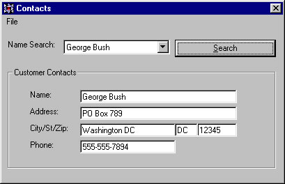



## Contact Application

### Description

This small application will allow users to search for contacts by name using a ComboBox. This project shows use of ADO, Search Methods, and Modular programming.
 
### More Info
 
The user can select a name and search for the record using a Combo Box.

There is little error handling in this application. It could be add with ease.

             |
---                |---
**Submitted On**   |2001-09-07 14:47:18
**By**             |[Adam T\. Lankford](https://github.com/Planet-Source-Code/PSCIndex/blob/master/ByAuthor/adam-t-lankford.md)
**Level**          |Intermediate
**User Rating**    |4.7 (14 globes from 3 users)
**Compatibility**  |VB 6\.0
**Category**       |[Databases/ Data Access/ DAO/ ADO](https://github.com/Planet-Source-Code/PSCIndex/blob/master/ByCategory/databases-data-access-dao-ado__1-6.md)
**World**          |[Visual Basic](https://github.com/Planet-Source-Code/PSCIndex/blob/master/ByWorld/visual-basic.md)
**Archive File**   |[Contact Ap26074972001\.zip](https://github.com/Planet-Source-Code/adam-t-lankford-contact-application__1-27052/archive/master.zip)

